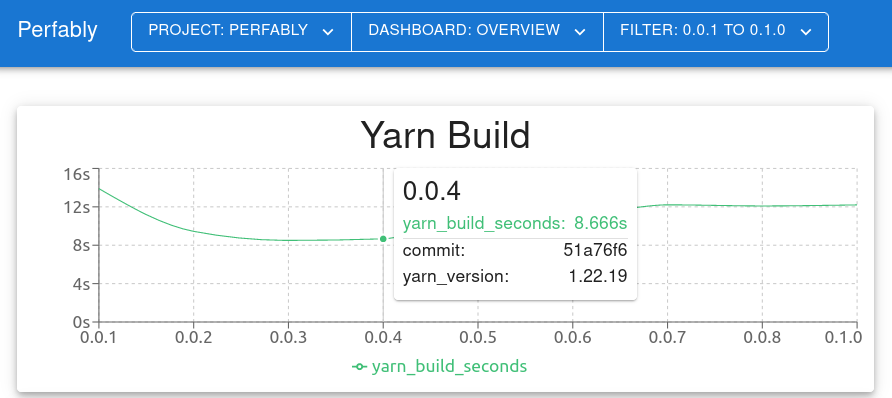

# Perfably

A performance dashboard to compare metrics between software versions like the
[Jenkins Performance Plugin](https://plugins.jenkins.io/performance/) but in
modern and CI server independent.

We used the Jenkins Performance Plugin but it's not customizable and looks old
fashioned. So we created Perfably. Send performance metrics and meta data after
every CI build via a simple HTTP API to perfably and get beautiful dashboards.

Here is an example for adding data to Perfably:

```
$ hyperfine --runs 1 'yarn build' --export-json result.json
$ http -a $AUTH --json POST "https://example.com/project/perfably/report/0.0.1" \
   "yarn_build_seconds:=$(jq '.results[].mean' result.json)"
$ http -a $AUTH --json POST "https://example.com/project/perfably/report/0.0.1/meta" \
   "yarn_version[value]=$(yarn --version)" \
   "commit[value]=$(git rev-parse HEAD)" \
   "commit[url]=https://github.com/FACT-Finder/perfably/commit/$(git rev-parse HEAD)"
```

And this is what the dashboard could look like:



## Install

### Docker

The [perfably/perfably](https://hub.docker.com/r/perfably/perfably) container
exposes the UI and HTTP API on port 8000. The users, metrics and meta data are
stored inside `/opt/perfably`. No container is tagged with `latest` use
`unstable`, if you don't want to explicitly define the tag (not recommended).

```bash
$ docker run -v "$PWD/data:/opt/perfably" -p 8000:8000 perfably/perfably:$VERSION
```

### Binary

Download the latest release
[here](https://github.com/FACT-Finder/perfably/releases/latest), uncompress the
archive and start perfably:

```bash
$ ./perfably --help
```

### Source

1. Install Go 1.18, Node >= 16 and a recent version of Yarn.
1. Install [oapi-codegen](https://github.com/deepmap/oapi-codegen)
   ```bash
   $ go install github.com/deepmap/oapi-codegen/cmd/oapi-codegen@v1.11.0
   ```
1. Build the UI:
   ```bash
   $ (cd ui && yarn install && yarn build)
   ```
1. Run code generators (this downloads the swagger artifacts and generates the
   server methods from the openapi spec)
   ```bash
   $ go generate ./...
   ```
1. Build with Go:
   ```bash
   $ go build
   ```

## Config

In the config the projects and dashboards are defined. See [example config with
comments](./config.example.yml).

## API

The API is documented via OpenAPI3, you can view the [raw spec](./openapi.yaml)
or
[swagger ui](https://editor.swagger.io/?url=https://raw.githubusercontent.com/FACT-Finder/perfably/main/openapi.yaml).
The Swagger UI is also served on `/docs/` on a running Perfably instance.
